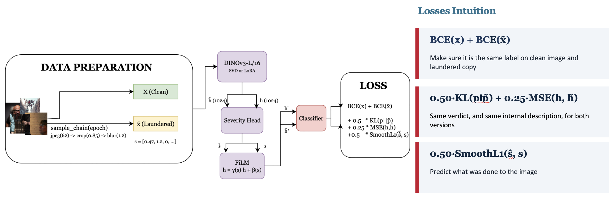
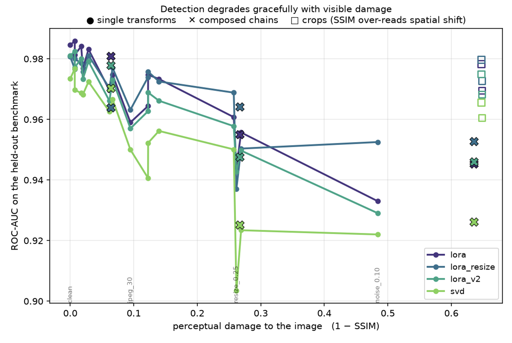
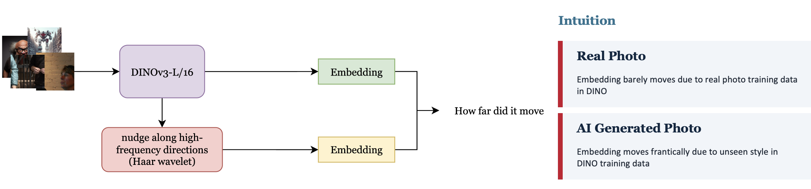

# aigc-detector

Robust detection of AI-generated images under real-world transformations.
TikTok TechJam 2026, Track 5.

**0.9807 ROC-AUC** on the provided benchmark COCO val2017 against DALL·E
Advanced, a generator never seen during training,  holding above 0.93 under
every transformation

---

## Problem Statement

Detection looks solved: models report 99% on clean benchmarks. But images get
posted, re-encoded, screenshotted, cropped and reposted. We call that
**laundering**.

Before building anything we checked the data, and realised simple vision model would take shortcut into just looking at the aspect ratio, since AI generated image would most likely be a square.

## Approach



Every training image is paired with a
laundered copy, compressed, cropped, resized, noised, in random combinations
that lengthen as training progresses. Both copies carry the same label, because
laundering does not change whether an image was generated.

**Severity supervision is free.** We apply the transforms, so we know the exact
parameters. The severity head is trained on labels that cost nothing to produce.

**The severity head is gradient-detached.** The consistency loss wants features
*blind* to degradation; the severity head wants features *sensitive* to it.
Detaching lets the trunk optimise for one while the head reads the other.

Loss:

```
BCE(clean) + BCE(laundered) + 0.50·KL(p‖p̃) + 0.25·MSE(h,h̃) + 0.50·SmoothL1(ŝ,s)
```

## Results

### Robustness on the provided benchmark

| | AUC | | | AUC |
|---|---|---|---|---|
| **clean** | **0.9807** | | jpeg_50 | 0.9704 |
| jitter_0.2 | 0.9811 | | noise_0.05 | 0.9688 |
| cast_0.2 | 0.9800 | | jpeg_30 | 0.9632 |
| crop_0.8 | 0.9797 | | noise_0.10 | 0.9525 |
| blur_0.5 | 0.9785 | | blur_2.0 | 0.9504 |
| noise_0.02 | 0.9770 | | **resize_0.25** | **0.9371** |
| jpeg_90 | 0.9765 | | *crop_repost* | *0.9728* |
| blur_1.0 | 0.9758 | | *screenshot* | *0.9641* |
| jpeg_70 | 0.9757 | | *repost_x2* | *0.9639* |
| resize_0.5 | 0.9739 | | *heavy_launder* | *0.9528* |
| moire_0.6 | 0.9725 | | | |

### Attack cost

Rather than AUC under a fixed transform list, we ask the adversary's question:
for each correct prediction, what is the cheapest laundering that flips it?
Cost is measured as perceptual damage (1 − SSIM) so every operation sits on one
physically meaningful axis.



| model | survives 0.05 damage | survives 0.4 | never flipped |
|---|---|---|---|
| **LoRA** | **0.9451** | **0.8248** | **0.7292** |
| SVD | 0.9378 | 0.7904 | 0.7069 |
| frozen probe | 0.9384 | 0.7256 | 0.6402 |
| full fine-tune | 0.8914 | 0.6494 | 0.5630 |

**73% of correct predictions cannot be flipped by any laundering we tested.**

## What did not work



**WaRPAD** (NeurIPS 2025). We implemented it as a second, decorrelated cue. Its
score direction turned out to be dataset-dependent. The intuition is DINO is trained on real images, so laundering a real image would move the embedding of it very little, but not for AI images.

## Setup

```bash
git clone <repo> && cd aigc-detector
uv sync
export AIGCD_DATA_ROOT=/path/with/60GB    # data never lives in the repo
./scripts/download_data.sh stage0 stage1 stage2 stage3   # stage1 is the held-out test set
```

## Reproducing

```bash
python scripts/extract_images.py --splits train val --wildfake \
    --mode resize --out-dir extracted_resize
python scripts/train.py --arm lora --tag resize --epochs 5 \
    --manifest data/extracted_resize/manifest.csv
python scripts/build_heldout.py --train-manifest data/extracted_resize/manifest.csv
python scripts/eval_peft.py --checkpoint checkpoints/lora_r32_film_resize.pt \
    --manifest data/heldout/manifest.csv --split heldout
python scripts/attack_cost.py --checkpoint checkpoints/lora_r32_film_resize.pt \
    --manifest data/heldout/manifest.csv --split heldout
python scripts/error_analysis.py --checkpoint checkpoints/lora_r32_film_resize.pt
python scripts/eval_generators.py        # leave-one-generator-out
python scripts/calibrate.py --checkpoint checkpoints/lora_r32_film_resize.pt
```

`--out-dir` must contain `resize`: the alignment used at inference is read back
off the manifest path recorded in the checkpoint, so a resize-trained model
built elsewhere would be scored with crop alignment.

Swap `--arm` for `frozen`, `full`, or `svd` to reproduce the ablation. These
commands regenerate the tables in `results/tables/`; the figures come from the
`scripts/plot_*.py` companions.

### Required deliverable — directory to JSON

```bash
python scripts/predict.py --input-dir path/to/images --output predictions.json --checkpoint checkpoints/lora_r32_film_resize_slim.pt
```

```json
[{"image_path": "img_001.jpg", "pred": 0.982}]
```

### Demo

https://aigc-detector-513190141038.asia-southeast1.run.app/

Might need to wait due to cold start

## Built with

PyTorch, timm (DINOv3-L/16), scikit-learn, Pillow, scikit-image, imagehash,
pandas, Gradio, GCP Cloud Run, Weights & Biases. Data: SID_Set (HuggingFace), WildFake
(ModelScope). Trained on NSCC ASPIRE-2A (NVIDIA A100).
